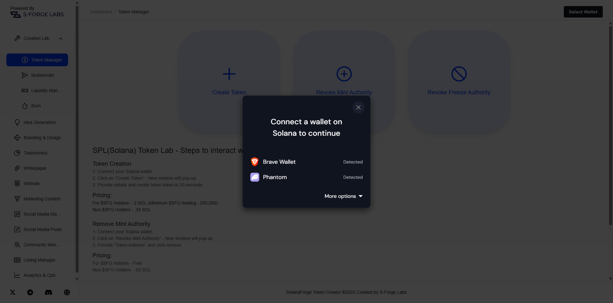
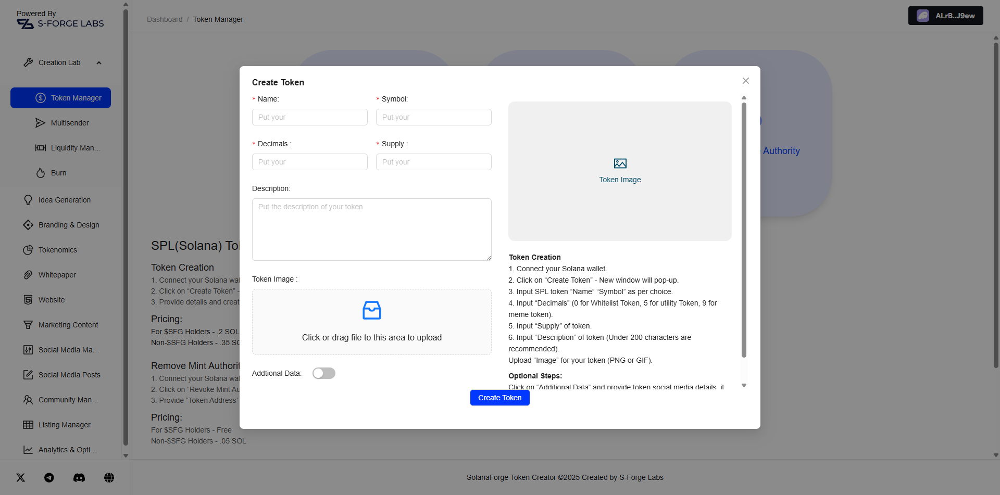
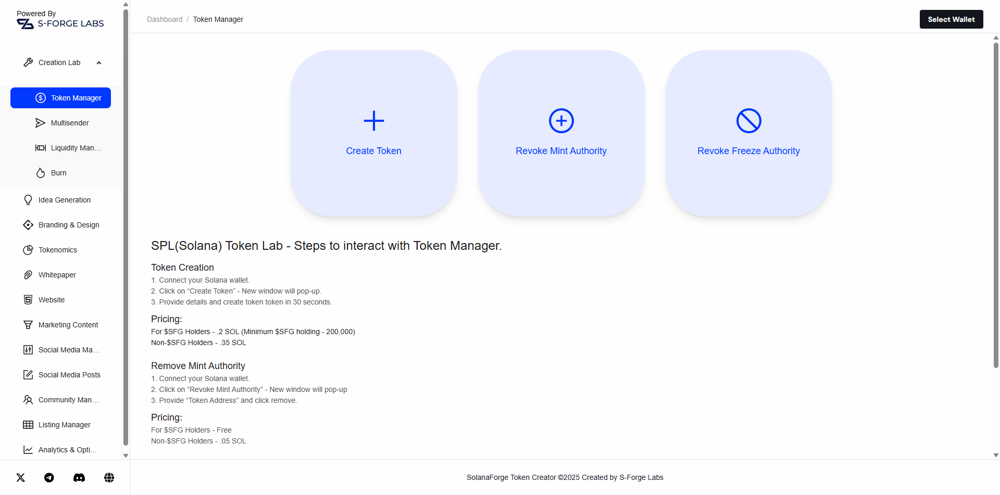

# 🧪 S-Forge Labs – Solana Token Creator

S-Forge Labs presents a clean, blazing-fast, and developer-friendly Solana Token Creator. Designed for Web3 builders, DeFi experimenters, and token creators of all levels, this tool streamlines the process of launching SPL tokens on the Solana blockchain with a **one-click interface**.

Forget overly complex forms and manual authority revocation—**S-Forge makes it effortless.**

---

## ✨ Features Overview

### 🔗 1. Wallet Integration

- Detects and connects with **Phantom** and **Brave** wallets seamlessly.
- Instant wallet status updates via a responsive UI.
- Shows wallet address, balance, and connection state.

### 🛠️ 2. Create Token Form

- Uses **Ant Design (antd)** components for smooth form UX and validation.
- Input token details: Name, Symbol, Supply, Decimals.
- Drag-and-drop **image upload** for token branding (with preview).
- Instantly generates an SPL token upon wallet confirmation.

### 🧾 3. Minting & Authority Options

- Toggle checkboxes to revoke **Mint Authority** or **Freeze Authority** after creation.
- Helps make the token non-mintable and immutable—ideal for secure launches.

### 📤 4. Multi-Sender Tool

- Send tokens to multiple addresses in one click.
- CSV or multiline text address input supported.
- Real-time validation and feedback using `antd` alerts.

### 🌊 5. Raydium SDK Integration

This platform goes beyond just token creation. It integrates the **Raydium SDK** to offer powerful liquidity automation:

#### ✅ Launch Liquidity Pools

- Automatically create liquidity pools for your SPL token on Raydium.

#### 📆 Schedule Pool Launches

- Preconfigure launch times.
- Works seamlessly with `setTimeout` strategies and crons (backend optional).

#### 💹 OpenBook Market Creation

- Launch corresponding **OpenBook markets** to support spot trading.
- Uses Raydium SDK functions to deploy market IDs with associated token pairs.

> 💡 This enables instant liquidity and trading availability **right after** token minting.

---

## 💻 Tech Stack

| Category       | Stack                                      |
| -------------- | ------------------------------------------ |
| Frontend       | React.js, **Ant Design (antd)** UI Library |
| Styling        | Tailwind CSS + Ant Design Tokens           |
| Blockchain SDK | `@solana/web3.js`                          |
| Wallets        | Phantom, Brave Wallet                      |
| State Handling | React Hooks + Context API                  |
| Image Upload   | Ant Design Upload + Base64 Conversion      |
| Deployment     | Vercel                                     |

---

## 🖼️ UI Previews

### 🔐 Connect Wallet

Prompt to select wallet from supported providers (Phantom or Brave):

---

### 📄 Token Creation Form

Ant Design–powered form with token options:

---

### 🏠 Disconnected Home Page

Landing screen with wallet not connected:

---

## 🚀 Why This Project?

### 🔥 One-Click Simplicity with Ant Design Polish

Most token tools are cluttered or overly technical. This project:

- Minimizes user input requirements.
- Provides a **single-step token launch**.
- Leverages Ant Design for a polished, enterprise-grade user experience.

Ideal for:

- **Hackathons**
- **Meme coins**
- **Token experiments**
- **Community or airdrop projects**

---

## ⚡ How to Use

1. **Connect Wallet**  
   Connect your Phantom or Brave wallet from the homepage.

2. **Fill the Form**  
   Enter token details. Ant Design handles validation and feedback.

3. **Upload Token Logo**  
   Drag & drop or select a PNG/JPEG logo.

4. **Launch the Token**  
   Click "Create Token", approve the transaction via wallet.

5. **Done!**  
   Token mint address and explorer link are shown in a notification.

---

## 🛡️ Security Notes

- Your wallet handles all signing. No private keys are exposed.
- You can revoke authorities directly after token creation for added safety.
- Built with secure practices using `@solana/web3.js`.

---

## 🧑‍🚀 Built By

**Mehul Singh Rathore**  
Web3 Developer • Solana Enthusiast • Automation Geek  
🔗 [LinkedIn](https://linkedin.com) • 🐦 [Twitter](https://twitter.com)

---

## 📜 License

This project is open source under the [MIT License](LICENSE).

---

## 📬 Get in Touch

Looking to collaborate on Web3 tools, tokenomics experiments, or dApps?  
Feel free to connect via LinkedIn or drop me a DM on Twitter!

---

**Made with ❤️ by S-Forge Labs – Solana Tools for Builders**
